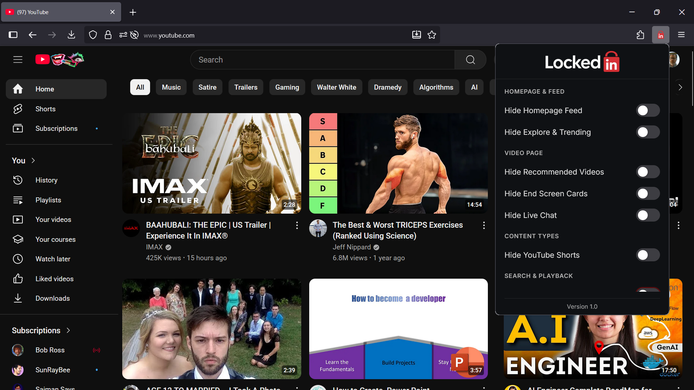
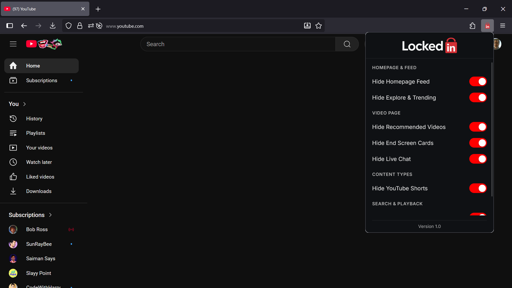
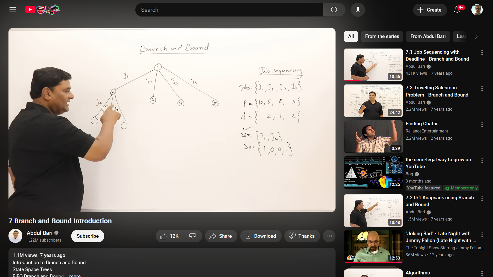
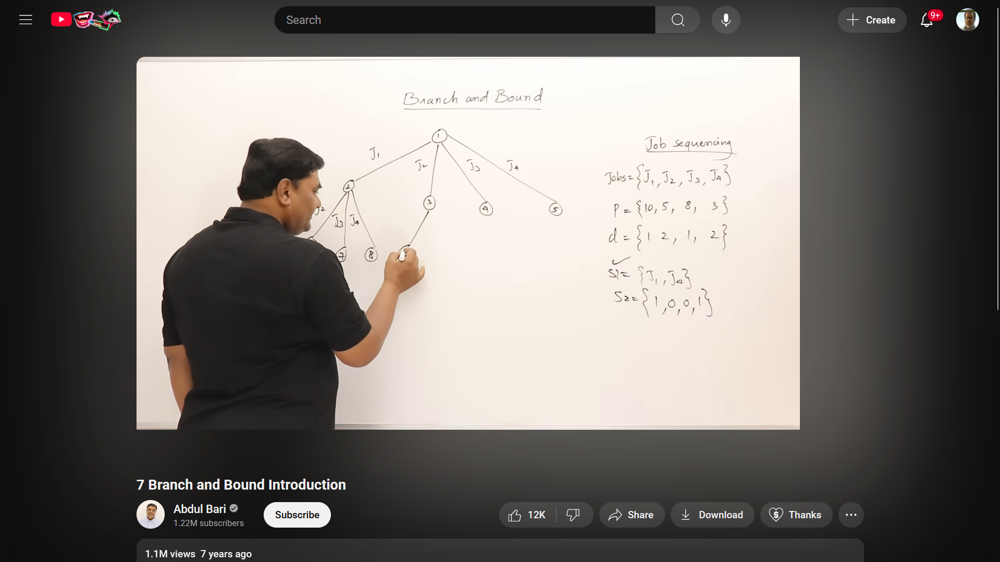

  
    
  <h1>Escape the Algorithm. Reclaim Your Focus.</h1>

### The Problem: The YouTube Rabbit Hole 

You open YouTube with a noble goal: to learn a new skill, watch a documentary, or catch up on an educational series.

An hour later, you snap out of a trance. You've been scrolling through an endless feed of Shorts, algorithm-pushed recommendations, and viral **"brain rot"** that has nothing to do with why you came here. The rabbit hole is deep, and YouTube's engaging algorithm is masterfully designed to keep you there, consuming content instead of learning.

### The Solution: LockedIn 

**LockedIn is your escape hatch.** It's a powerful browser extension that puts *you* back in the driver's seat. It allows you to surgically remove every single distraction from the YouTube interface, transforming it into the incredible learning library it's meant to be.

With a sleek, modern, and intuitive popup menu, you can finally use YouTube on your own terms.

## 📸 See It In Action

See how LockedIn transforms the cluttered YouTube interface into a clean, focused environment.

---

#### 1. The Homepage: From Chaos to Calm
| Before LockedIn (Default YouTube) | After LockedIn (Feed Hidden) |
| :---: | :---: |
| *An endless grid of distracting recommendations.* | *A clean slate, ready for your intentional search.* |
|  |  |

---

#### 2. The Video Page: Focus on the Content
| Before LockedIn (Default YouTube) | After LockedIn (Recommended Videos Hidden) |
| :---: | :---: |
| *A sidebar of "Up Next" videos pulling your attention away.* | *Just the video and its description. Nothing else.* |
|  |  |

---

> **Note: This is just Version 1.0!**
> This is the first public release. I'm actively working on fixing any bugs and adding even more powerful features in upcoming updates. Your feedback and contributions are welcome!

## ✨ Features (Current)

Lock down your YouTube experience with granular control. Hide what you don't want, keep what you need.

| Feature | Status | Description |
| :--- | :---: | :--- |
| 🚫 **Hide Homepage Feed** | ✅ Complete | Erase the entire grid of recommended videos on the homepage. |
| 🙈 **Hide Recommended Videos** | ✅ Complete | Remove the "Up Next" sidebar next to videos. |
| 🩳 **Hide Shorts Tab**| ✅ Complete | Annihilates Shorts Tab from the sidebar. |
| 💬 **Hide Live Chat** | ✅ Complete | Remove the distracting live chat replay. |
| 🔚 **Hide End Screen Cards** | ✅ Complete | Block the video suggestions that appear at the end of videos. |
| 🧭 **Hide Explore & Trending** | ✅ Complete | Nuke the entire "Explore" section from the sidebar. |
| 🔄 **Disable Autoplay** | ✅ Complete | Stop the next video from automatically playing. |

## → Roadmap: What's Next?

LockedIn is just getting started. Here's a preview of what's planned for future updates:

* **Total Shorts Annihilation:** An even more powerful filter to eliminate Shorts from *everywhere* (including history and playlists) without a trace.
* **Focus Modes:** Introducing **"LockedIn Moderate"** (for casual focus) and **"LockedIn Hard"** (for deep work), which will automatically set the best combination of toggles.
* **Light Mode Theme:** A new, clean light-mode theme for the popup, with a toggle to switch between light and dark.
* **And more:** Bug fixes, performance improvements, and other features based on user feedback.

## Availability

* **Firefox Add-ons:** Coming soon! The extension is being prepared for review.
* **Chrome Web Store:** Planned for a future release.

This project was heavily inspired by the fantastic work on the [Unhook]([https://github.com/hook-flow/unhook](https://addons.mozilla.org/en-US/firefox/addon/youtube-recommended-videos/?utm_source=addons.mozilla.org&utm_medium=referral&utm_content=search)) extension. LockedIn aims to provide a similar level of powerful control with a unique and modern user interface.

## → Installation (Manual for Firefox)

Until it's officially listed, you can install LockedIn in Firefox with these steps:

1.  **Download:** Download this repository as a ZIP file and unzip it.
2.  **Open Firefox:** Launch the browser.
3.  **Navigate to `about:debugging`:** Type this into your address bar and press Enter.
4.  **Load Add-on:** Click on **"This Firefox"** on the left, then click the **"Load Temporary Add-on..."** button.
5.  **Select the Manifest:** Navigate into the `LockedIn` folder and select the `manifest.json` file.

The LockedIn icon will appear in your toolbar, ready to use!

## 🛠️ Built With

* **HTML5** & **CSS3** for the sleek, modern UI.
* **Plain JavaScript** for lightweight and fast performance.
* **WebExtensions API** for browser interaction.

---

  <h3>Stop scrolling. Start learning.</h3>

