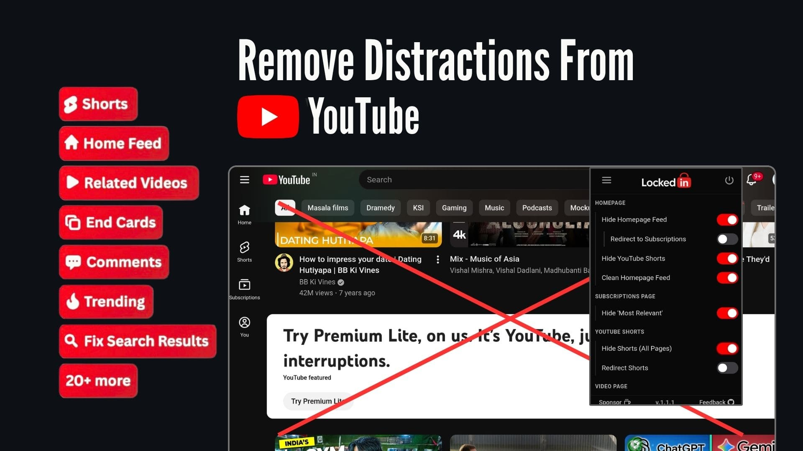
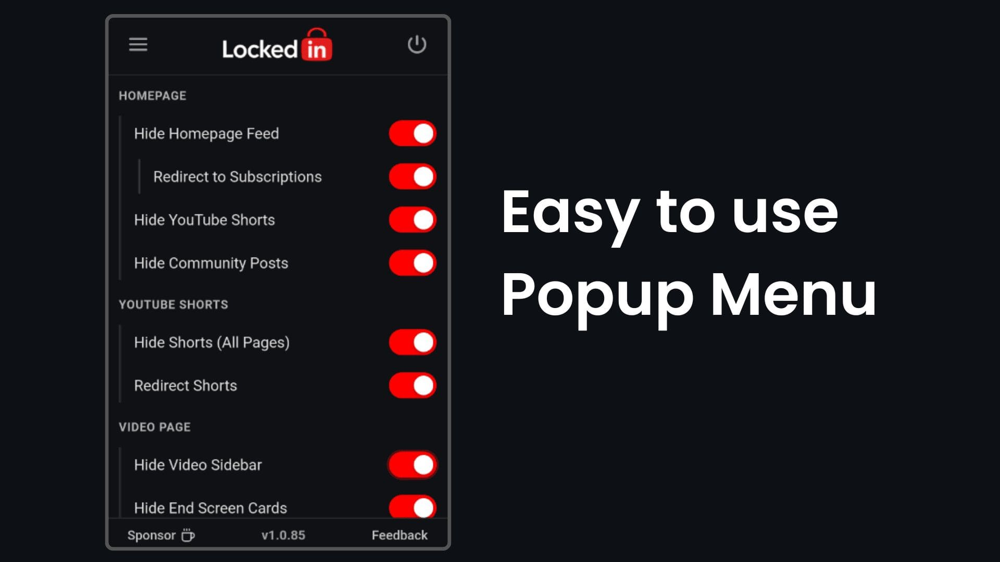
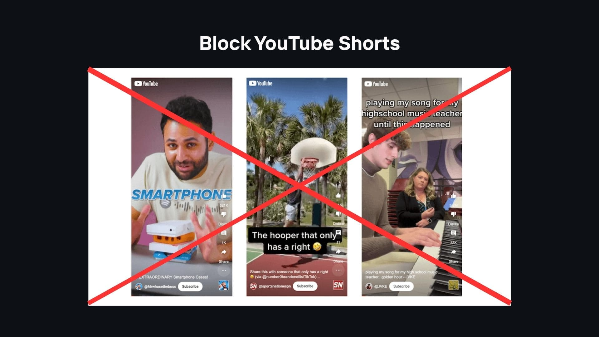
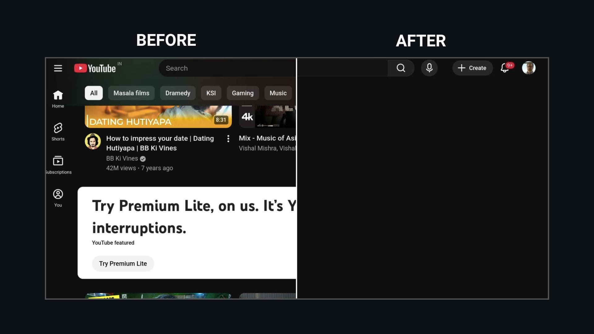
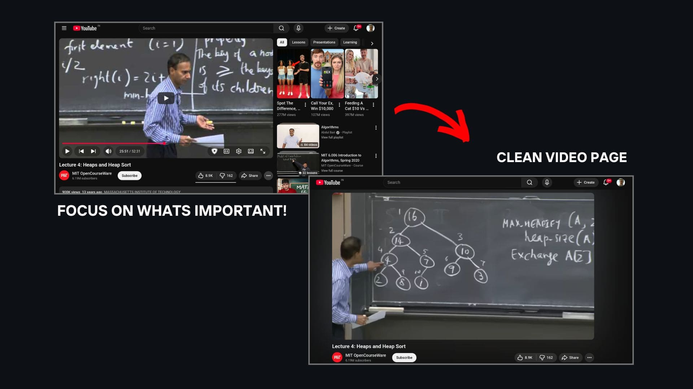
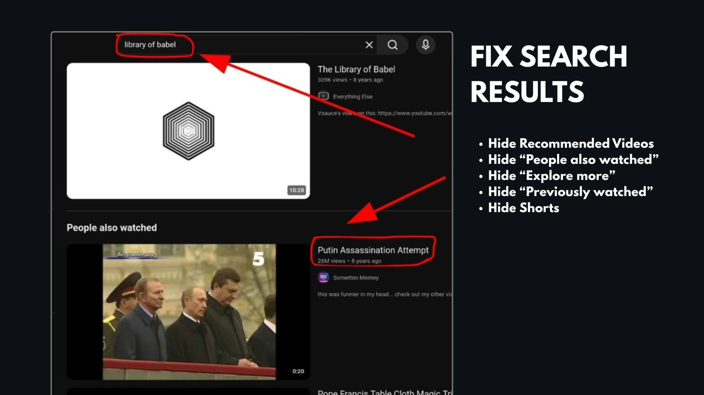
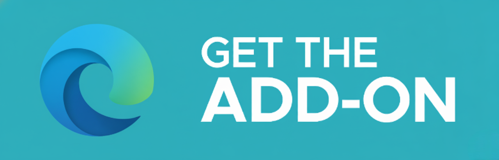
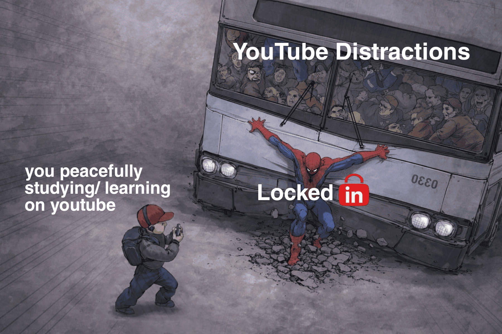

<h1>LockedIn</h1>

  <h3> YouTube Productivity Browser Extension </h3>

<h2 style="margin: 0;"><strong>About</strong></h2>
LockedIn is an open-source browser extension that helps you focus on YouTube by removing distracting elements like Shorts, Homepage feed, Recommended videos, Thumbnails and more.

  

 

 

---

<h1>Screenshots</h1>

---

<h1>Download Now</h1>

<table>
<tr>
<td align="center">

</td>
<td align="center">

</td>
<td align="center">

</td>
</tr>

</table>

---

# Table of Contents

<table>
<tr>
<td align="left">

- [Features](#features)
- [Building from Source](project-docs/BUILDING.md)
- [Contributing Guide](CONTRIBUTING.md)
- [Privacy Policy](PRIVACY.md)
- [Changelog](CHANGELOG.md)
- [Report Issues](https://github.com/KartikHalkunde/LockedIn-YT/issues)
- [Discussions](https://github.com/KartikHalkunde/LockedIn-YT/discussions)
- [Website](https://kartikhalkunde.github.io/LockedIn-YT/)

</td>
</tr>
</table>

---

# Features

<table>
<tr>
<td align="left">

- Hide Homepage Feed (replaces with motivational content)
- Hide YouTube Featured and Members-only content
- Smart Video Sidebar Controls:
  - Hide Recommended Videos while keeping playlists visible
  - Separate toggle for playlists visibility
- Block YouTube Shorts (separate controls for homepage & search)
- Hide Comments & Live Chat
- Hide Search Recommendations, Subscriptions & "More From YouTube"
- Disable Autoplay
- Instant element hiding with zero delays

</td>
</tr>
</table>

---

<h1>Support LockedIn</h1>

<h3>If LockedIn helps you stay focused, consider supporting its development!</h3>
 

**For Global Users:**

&nbsp;&nbsp;

&nbsp;&nbsp;
 

 

**For Indian Users (UPI):**

  

---

Made with ❤️ by [Kartik Halkunde](https://github.com/KartikHalkunde)

