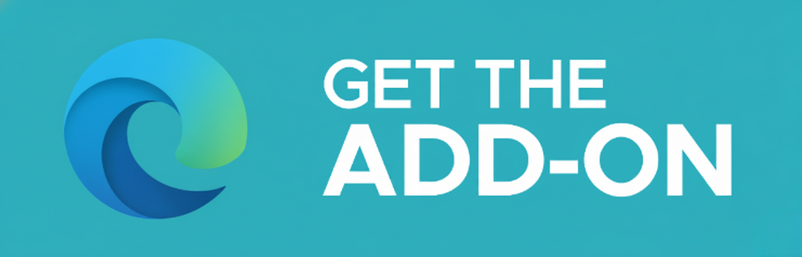

<h1>LockedIn</h1>

  <a> YouTube Productivity Extension for Firefox & Edge</a>

<h2 style="margin: 0;"><strong>About</strong></h2>
LockedIn is an open-source browser extension that helps you focus on YouTube by removing distracting elements like the homepage feed, Shorts, recommended videos, comments and more.

<h1>Screenshots</h1>

<h1>Release numbers</h1>

<h1>Download Now</h1>

<table>
<tr>
<td align="center">

</td>
<td align="center">

</td>
</tr>
</table>

<em>Coming Soon on Chrome Web Store!</em>

<h1>Table of Contents</h1>

- [Features](#features)
- [Building from Source](BUILDING.md)
- [Contributing Guide](CONTRIBUTING.md)
- [Privacy Policy](PRIVACY.md)
- [Changelog](CHANGELOG.md)
- [Report Issues](https://github.com/KartikHalkunde/LockedIn-YT/issues)
- [Discussions](https://github.com/KartikHalkunde/LockedIn-YT/discussions)
- [Website](https://kartikhalkunde.github.io/LockedIn-YT/)

<h1>Features</h1>

- Hide Homepage Feed (replaces with motivational content)
- Hide YouTube Featured and Members-only content
- Smart Video Sidebar Controls:
  - Hide Recommended Videos while keeping playlists visible
  - Separate toggle for playlists visibility
- Block YouTube Shorts (separate controls for homepage & search)
- Hide Comments & Live Chat
- Hide Search Recommendations, Subscriptions & "More From YouTube"
- Disable Autoplay
- Instant element hiding with zero delays
- New organized UI with 4 logical groups
- Power button to quickly toggle entire extension
- "Take a Break" mode (temporarily disables extension with auto-redirect)
- Stats tracking for time saved and content blocked
- **Privacy:** Zero data collection. No external network requests.

<h1>Support Me</h1>

If LockedIn helps you stay focused, consider supporting its development!

**For Indian Users (UPI):**

**For Global Users:**

&nbsp;

  

Made with ☕ by [Kartik Halkunde](https://github.com/KartikHalkunde)

